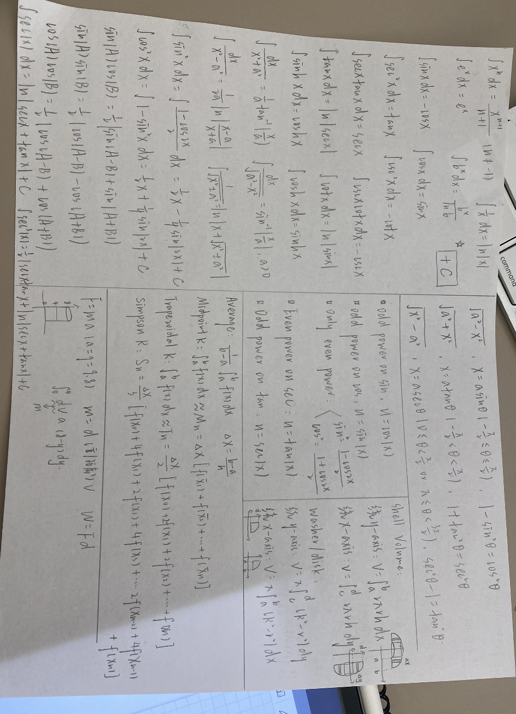
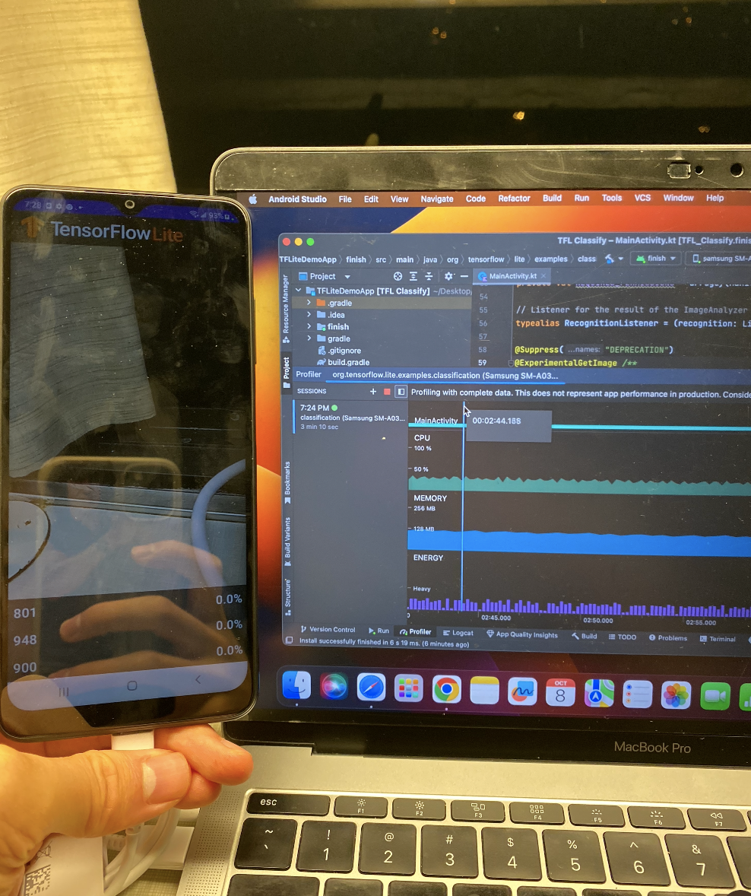

  This picture of my study notes helped me through my midterm and represented everything we've learned in Math 125 at that moment. It helped me grow as a thinker and learner by emphasizing the importance of notes -- something that seems clear at the moment might not later. This approach is something I'll definitely use in other courses and disciplines like math, with lots of pieces building on top of one another. These calculus skills may help me better understand change in the world through a rigorous, analytical mathematical framework, which is something that can be useful not only in technical careers but also applicable in everyday life.

**colab.research.google.com/drive/1oLYsj_XLuUZpDd311EWmHM4_LrXU2eBX?usp=sharing**

  This python notebook contains a custom implementation of a part of the algorithm behind chatGPT. It learns to read and write like Marcel Proust. I spent a long time experimenting and understanding this algorithm and in the moment, it represented the culmination of years of coding and math. It helped me grow as a thinker and learner by challenging me to understand from the first principles -- tracing my assumptions until they can no longer by further deduced. This strategy of learning by doing is something that really helped me understand something so complex, and I will be sure to use this skill in other courses and disciplines. This project may help me learn to make new helpful applications with AI algorithms.

  This is a picture of the final deployment of an AI algorithm onto a Samsung phone. At the moment of deployment, I was extremely relieved that it had worked, as I had spent a long time debugging the conversion from one algorithmic framework to another. Learning to debug, to think reasonably and fix errors through critical analysis and not by simply giving up helped me grow as a thinker. This skill of critical thinking will help me analyze and fix problems in math, biology, economics or any other classes and disciplines. I believe it will be also helpful when I face any problems in a professional career. 

